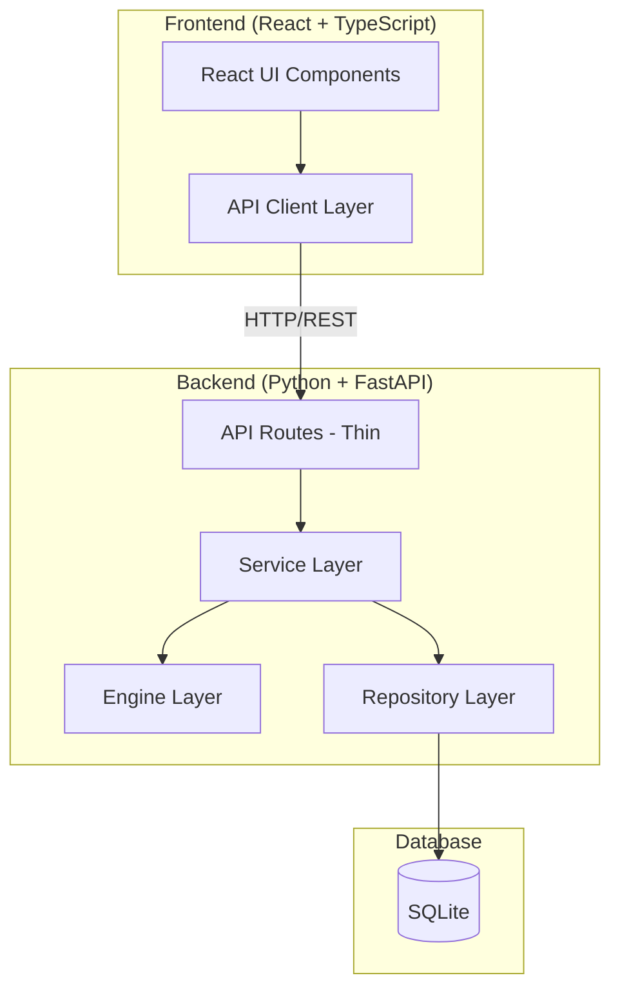
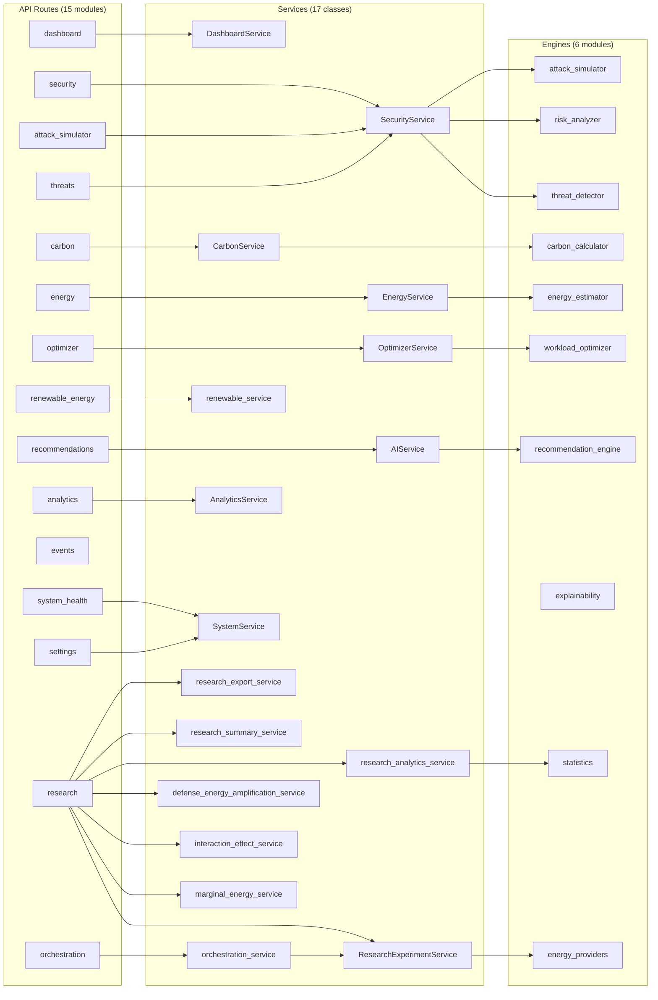
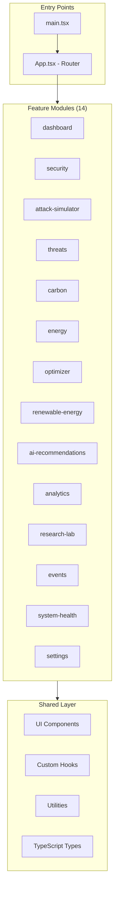
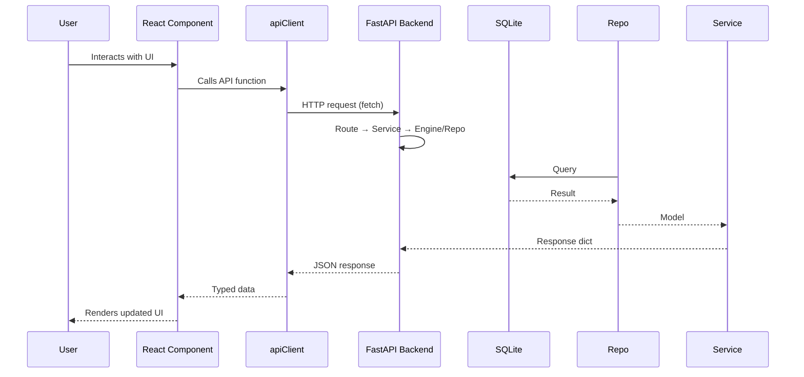
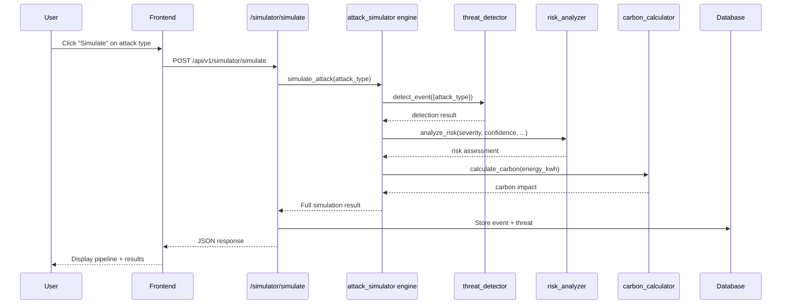

# Architecture

This document describes the actual architecture of the CarbonGuard platform as implemented.

> **Note**: All data in this system is **simulated/synthetic**. No real cyber attacks are performed, no real infrastructure is scanned, and all energy/carbon values are estimated using calculation models.

## High-Level Overview



## Backend Architecture

The backend follows a strict layered architecture with no circular dependencies:

```
main.py → api/ → services/ → repositories/ → models/
                     ↓
                  engines/
```

### Layer Responsibilities

| Layer | Location | Responsibility |
|-------|----------|---------------|
| **API Routes** | `app/api/` | Parse HTTP requests, validate input, call services, return responses. No business logic. |
| **Services** | `app/services/` | Business logic, validation, orchestration. Coordinates between repos and engines. |
| **Engines** | `app/engines/` | Domain-specific computation. Pure functions/classes with no DB dependency. |
| **Repositories** | `app/repositories/` | Database CRUD operations. Wraps SQLAlchemy queries. |
| **Models** | `app/models/` | SQLAlchemy ORM model definitions. |
| **Schemas** | `app/schemas/` | Pydantic models for API request/response validation. |

### Backend Module Map



### Key Engine Functions

| Engine | Functions | Purpose |
|--------|-----------|---------|
| `threat_detector` | `detect_event()`, `classify_severity()`, `generate_event_uuid()` | Detects and classifies simulated threats |
| `risk_analyzer` | `analyze_risk()` | Calculates weighted risk scores from 5 factors |
| `attack_simulator` | `simulate_attack()` | Full pipeline: detect → risk → carbon → recommendation |
| `carbon_calculator` | `calculate_carbon()`, `calculate_security_carbon_efficiency()`, `estimate_workload_energy()` | Core carbon formulas |
| `energy_estimator` | `estimate_energy_consumption()`, `estimate_security_workload_energy()` | Power/energy estimation models |
| `workload_optimizer` | `optimize_workloads()`, `generate_sample_workloads()` | Carbon-aware scheduling |
| `recommendation_engine` | `generate_recommendations()` | Rule-based multi-factor recommendations |
| `explainability` | `explain_prediction()`, `explain_recommendation()` | Human-readable explanation generation |
| `energy providers` | `get_provider()`, `get_measurement()` | ESTIMATED/MEASURED energy provider abstraction used by Phases 5-7 |
| `statistics` | `descriptive_statistics()`, `confidence_interval_t()`, `paired_t_test()`, `wilcoxon_signed_rank()`, `cohens_dz()` | Deterministic research statistics (Phase 8) |

## Frontend Architecture

The frontend uses a feature-based organization with shared components:



The `research-lab` module hosts the seven Research Lab routes (overview,
marginal energy, interaction analysis, defense amplification, experiments,
experiment detail, dataset) — Phases 9-12. See
[RESEARCH_ARCHITECTURE.md](RESEARCH_ARCHITECTURE.md).

### Shared UI Components (14)

| Component | Purpose |
|-----------|---------|
| `Button` | Configurable button with variants (primary, secondary, danger, ghost) |
| `Card`, `CardHeader`, `CardContent`, `CardTitle` | Card layout primitives |
| `Badge`, `SeverityBadge`, `StatusBadge` | Status and severity indicators |
| `StatusIndicator` | Online/offline/degraded status display |
| `MetricCard` | Metric display with title, value, trend |
| `StatCard` | Statistics card with trend direction |
| `PageHeader` | Page title with subtitle, badge, and actions |
| `LoadingSpinner` | Loading state indicator |
| `ChartContainer` | Chart wrapper with title |
| `DataTable` | Generic table with columns and empty state |
| `ThreatLevel` | Threat level indicator with animated dot |
| `Header` | Top navigation bar |
| `Sidebar` | Side navigation with collapsible menu |

### Frontend Data Flow



## Data Flow: Security Event Simulation

The attack simulation demonstrates the full pipeline:



## Data Flow: End-to-End CarbonGuard Pipeline (Phase 13)

`POST /api/v1/orchestration/run` extends the simulation flow above into the
complete lifecycle: attack → threat → risk → rule-based defense controls →
energy measurement (provider abstraction) → carbon calculation → optional
research observation → analytics feeds. It orchestrates the existing engines
and services without adding duplicate formulas or storage.

See [PIPELINE.md](PIPELINE.md) for the component mapping, provenance rules
(energy measurement mode, carbon basis), failure handling and the response
schema.

## Carbon Calculation Formula

```
Energy (kWh) × Carbon Intensity (gCO2/kWh) = Gross CO2 (gCO2)
Gross CO2 × (Renewable % / 100) = Renewable Offset (gCO2)
Gross CO2 - Renewable Offset = Net CO2 (gCO2)
```

Default values: `carbon_intensity = 475 gCO2/kWh`, `renewable_percentage = 25%`

## Workload Optimization Rules

1. Critical security tasks are **NEVER** delayed for carbon savings
2. Non-critical tasks may be shifted to lower-carbon periods
3. Shift window is limited to `MAX_DELAY_HOURS` (default: 4 hours)
4. Minimum savings threshold must be met to justify shifting
5. Non-critical tasks are sorted by priority (high → medium → low) before shifting

## Technology Stack

| Layer | Technology | Version |
|-------|-----------|---------|
| Frontend Framework | React | 18.3.1 |
| Frontend Language | TypeScript | 5.4.5 |
| Build Tool | Vite | 5.4.2 |
| CSS Framework | Tailwind CSS | 3.4.4 |
| Charting | Recharts | 2.12.7 |
| Routing | React Router | 6.23.1 |
| Backend Framework | FastAPI | 0.115+ |
| Backend Language | Python | 3.12 |
| ORM | SQLAlchemy | 2.0+ |
| Validation | Pydantic | 2.10+ |
| Database | SQLite | — |
| Backend Testing | pytest | 9.1.1 |
| Frontend Testing | Vitest | 4.1.11 |
| Containerization | Docker | — |
| CI/CD | GitHub Actions | — |
