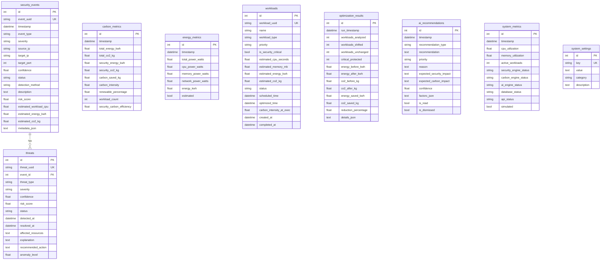

# Database Schema

CarbonGuard uses **SQLite** for development (easily migrable to PostgreSQL). The database is managed via SQLAlchemy 2.0 ORM.

> **Note**: All data in the database is **simulated/synthetic**. The database stores simulated security events, threats, and optimization results — not real infrastructure data.

## Entity Relationship Diagram

## Tables

### security_events

Stores simulated security events detected by the system.

| Column | Type | Description |
|--------|------|-------------|
| `id` | INTEGER PK | Auto-increment ID |
| `event_uuid` | VARCHAR(36) UNIQUE | Event UUID |
| `timestamp` | DATETIME | Event timestamp |
| `event_type` | VARCHAR(50) | Attack type (ddos, brute_force, etc.) |
| `severity` | VARCHAR(20) | CRITICAL, HIGH, MEDIUM, LOW |
| `source_ip` | VARCHAR(45) | Simulated source IP |
| `target_ip` | VARCHAR(45) | Simulated target IP |
| `target_port` | INTEGER | Target port |
| `confidence` | FLOAT | Detection confidence (0-1) |
| `status` | VARCHAR(30) | detected, investigating, blocked, resolved |
| `detection_method` | VARCHAR(100) | How the event was detected |
| `description` | TEXT | Event description |
| `risk_score` | FLOAT | Risk score (0-100) |
| `estimated_workload_cpu` | FLOAT | Estimated CPU seconds |
| `estimated_energy_kwh` | FLOAT | Estimated energy consumption |
| `estimated_co2_kg` | FLOAT | Estimated CO2 emissions |

### threats

Active and resolved threats linked to security events.

| Column | Type | Description |
|--------|------|-------------|
| `id` | INTEGER PK | Auto-increment ID |
| `threat_uuid` | VARCHAR(36) UNIQUE | Threat UUID |
| `event_id` | INTEGER FK | Links to security_events |
| `threat_type` | VARCHAR(50) | Type of threat |
| `severity` | VARCHAR(20) | Threat severity |
| `confidence` | FLOAT | Detection confidence |
| `risk_score` | FLOAT | Risk score |
| `status` | VARCHAR(30) | active, resolved, dismissed |
| `detected_at` | DATETIME | When detected |
| `resolved_at` | DATETIME | When resolved (nullable) |
| `explanation` | TEXT | AI-generated explanation |
| `recommended_action` | TEXT | Recommended response |

### carbon_metrics

Historical carbon emission measurements.

| Column | Type | Description |
|--------|------|-------------|
| `total_energy_kwh` | FLOAT | Total energy consumption |
| `total_co2_kg` | FLOAT | Total CO2 emissions |
| `security_energy_kwh` | FLOAT | Energy used by security operations |
| `security_co2_kg` | FLOAT | CO2 from security operations |
| `carbon_saved_kg` | FLOAT | CO2 saved through optimization |
| `carbon_intensity` | FLOAT | gCO2/kWh |
| `renewable_percentage` | FLOAT | % renewable energy |
| `security_carbon_efficiency` | FLOAT | Efficiency score |

### energy_metrics

Historical energy consumption measurements.

| Column | Type | Description |
|--------|------|-------------|
| `total_power_watts` | FLOAT | Total power consumption |
| `cpu_power_watts` | FLOAT | CPU power |
| `memory_power_watts` | FLOAT | Memory power |
| `network_power_watts` | FLOAT | Network power |
| `energy_kwh` | FLOAT | Energy in kWh |
| `estimated` | BOOLEAN | Whether this is estimated data |

### workloads

Security and non-security workloads for optimization.

| Column | Type | Description |
|--------|------|-------------|
| `workload_uuid` | VARCHAR(36) UNIQUE | Workload UUID |
| `name` | VARCHAR(200) | Workload name |
| `workload_type` | VARCHAR(50) | log_analysis, security_scan, backup, etc. |
| `priority` | VARCHAR(20) | critical, high, medium, low |
| `is_security_critical` | BOOLEAN | Whether this is security-critical |
| `estimated_cpu_seconds` | FLOAT | Estimated CPU time |
| `estimated_energy_kwh` | FLOAT | Estimated energy |
| `estimated_co2_kg` | FLOAT | Estimated CO2 |
| `status` | VARCHAR(30) | pending, scheduled, delayed, completed |
| `scheduled_time` | DATETIME | Original scheduled time |
| `optimized_time` | DATETIME | Optimized time (after scheduling) |

### optimization_results

History of workload optimization runs.

| Column | Type | Description |
|--------|------|-------------|
| `workloads_analyzed` | INTEGER | Total workloads analyzed |
| `workloads_shifted` | INTEGER | Workloads shifted to later time |
| `critical_protected` | INTEGER | Critical workloads kept on schedule |
| `energy_before_kwh` | FLOAT | Total energy before optimization |
| `energy_after_kwh` | FLOAT | Total energy after optimization |
| `co2_before_kg` | FLOAT | CO2 before optimization |
| `co2_after_kg` | FLOAT | CO2 after optimization |
| `reduction_percentage` | FLOAT | CO2 reduction percentage |

### ai_recommendations

AI-generated security and sustainability recommendations.

| Column | Type | Description |
|--------|------|-------------|
| `recommendation_type` | VARCHAR(50) | security, carbon, energy, workload, general |
| `recommendation` | TEXT | Recommendation text |
| `priority` | VARCHAR(20) | high, medium, low |
| `reason` | TEXT | Reason for recommendation |
| `confidence` | FLOAT | Confidence score |
| `factors_json` | TEXT | JSON array of contributing factors |
| `is_read` | BOOLEAN | Whether user has read it |
| `is_dismissed` | BOOLEAN | Whether user dismissed it |

### system_metrics

System health metrics over time.

| Column | Type | Description |
|--------|------|-------------|
| `cpu_utilization` | FLOAT | CPU utilization % |
| `memory_utilization` | FLOAT | Memory utilization % |
| `active_workloads` | INTEGER | Number of active workloads |
| `*_engine_status` | VARCHAR(20) | Status of each engine (online/offline) |
| `simulated` | BOOLEAN | Whether this is simulated data |

### system_settings

Configurable system parameters.

| Column | Type | Description |
|--------|------|-------------|
| `key` | VARCHAR(100) UNIQUE | Setting key |
| `value` | TEXT | Setting value |
| `category` | VARCHAR(50) | Setting category |
| `description` | TEXT | Human-readable description |
