# Database Schema

CarbonGuard uses **SQLite** for development (easily migrable to PostgreSQL). The database is managed via SQLAlchemy 2.0 ORM.

> **Note**: All data in the database is **simulated/synthetic**. The database stores simulated security events, threats, and optimization results — not real infrastructure data. The research tables (Phases 1, 4-8) store synthetic experiment results; every row carries `measurement_mode` provenance (ESTIMATED / MEASURED / SIMULATED) and a `formula_version` identifying the calculation that produced it. Measured values are only stored when a genuine provider measured them — nothing is fabricated.

## Entity Relationship Diagram

```mermaid
erDiagram
    security_events ||--o{ threats : "has"
    security_events {
        int id PK
        string event_uuid UK
        datetime timestamp
        string event_type
        string severity
        string source_ip
        string target_ip
        int target_port
        float confidence
        string status
        string detection_method
        text description
        float risk_score
        float estimated_workload_cpu
        float estimated_energy_kwh
        float estimated_co2_kg
        text metadata_json
    }
    threats {
        int id PK
        string threat_uuid UK
        int event_id FK
        string threat_type
        string severity
        float confidence
        float risk_score
        string status
        datetime detected_at
        datetime resolved_at
        text affected_resources
        text explanation
        text recommended_action
        float anomaly_level
    }
    carbon_metrics {
        int id PK
        datetime timestamp
        float total_energy_kwh
        float total_co2_kg
        float security_energy_kwh
        float security_co2_kg
        float carbon_saved_kg
        float carbon_intensity
        float renewable_percentage
        int workload_count
        float security_carbon_efficiency
    }
    energy_metrics {
        int id PK
        datetime timestamp
        float total_power_watts
        float cpu_power_watts
        float memory_power_watts
        float network_power_watts
        float energy_kwh
        bool estimated
    }
    workloads {
        int id PK
        string workload_uuid UK
        string name
        string workload_type
        string priority
        bool is_security_critical
        float estimated_cpu_seconds
        float estimated_memory_mb
        float estimated_energy_kwh
        float estimated_co2_kg
        string status
        datetime scheduled_time
        datetime optimized_time
        float carbon_intensity_at_exec
        datetime created_at
        datetime completed_at
    }
    optimization_results {
        int id PK
        datetime run_timestamp
        int workloads_analyzed
        int workloads_shifted
        int workloads_unchanged
        int critical_protected
        float energy_before_kwh
        float energy_after_kwh
        float co2_before_kg
        float co2_after_kg
        float energy_saved_kwh
        float co2_saved_kg
        float reduction_percentage
        text details_json
    }
    ai_recommendations {
        int id PK
        datetime timestamp
        string recommendation_type
        text recommendation
        string priority
        text reason
        text expected_security_impact
        text expected_carbon_impact
        float confidence
        text factors_json
        bool is_read
        bool is_dismissed
    }
    system_metrics {
        int id PK
        datetime timestamp
        float cpu_utilization
        float memory_utilization
        int active_workloads
        string security_engine_status
        string carbon_engine_status
        string ai_engine_status
        string database_status
        string api_status
        bool simulated
    }
    system_settings {
        int id PK
        string key UK
        text value
        string category
        text description
    }
    experiments ||--o{ experiment_runs : "has"
    experiment_runs ||--o{ energy_measurements : "measures"
    experiment_runs ||--o{ security_effectiveness : "records"
    experiment_runs ||--o{ research_metrics : "derives"
    experiments ||--o{ energy_attributions : "phase 5"
    experiments ||--o{ interaction_results : "phase 6"
    experiments ||--o{ defense_amplification_results : "phase 7"
    experiments {
        int id PK
        string experiment_uuid UK
        string name
        string experiment_type
        string attack_type
        string attack_intensity
        string measurement_mode
        int num_trials
        string status
        datetime created_at
    }
    experiment_runs {
        int id PK
        string run_uuid UK
        int experiment_id FK
        int trial_number
        string attack_type
        string measurement_mode
        string status
        datetime start_time
    }
    energy_measurements {
        int id PK
        int run_id FK
        float energy_joules
        float power_watts
        float duration_seconds
        string source
        string measurement_mode
        datetime timestamp
    }
    security_effectiveness {
        int id PK
        int run_id FK
        float detection_rate
        float false_positive_rate
        float security_score
        text controls_active
    }
    research_metrics {
        int id PK
        int run_id FK
        string metric_name
        float metric_value
        string unit
        string formula_version
        string measurement_mode
    }
    energy_attributions {
        int id PK
        int experiment_id FK
        int baseline_run_id FK
        int security_run_id FK
        string attack_type
        float marginal_energy_joules
        float marginal_carbon_kg
        string measurement_mode
        string formula_version
    }
    interaction_results {
        int id PK
        int experiment_id FK
        string control_a
        string control_b
        float energy_ab
        float interaction_effect
        float interaction_index
        string measurement_mode
        string formula_version
    }
    defense_amplification_results {
        int id PK
        int experiment_id FK
        string control_name
        float energy_attack_only
        float energy_attack_defense
        float additional_defense_energy
        float defense_energy_amplification
        string measurement_mode
        string formula_version
    }
    research_analytics_results {
        int id PK
        string analysis_id UK
        string source
        string metric
        text request_json
        text response_json
        string analysis_version
    }
```

## Tables

### security_events

Stores simulated security events detected by the system.

| Column | Type | Description |
|--------|------|-------------|
| `id` | INTEGER PK | Auto-increment ID |
| `event_uuid` | VARCHAR(36) UNIQUE | Event UUID |
| `timestamp` | DATETIME | Event timestamp |
| `event_type` | VARCHAR(50) | Attack type (ddos, brute_force, etc.) |
| `severity` | VARCHAR(20) | CRITICAL, HIGH, MEDIUM, LOW |
| `source_ip` | VARCHAR(45) | Simulated source IP |
| `target_ip` | VARCHAR(45) | Simulated target IP |
| `target_port` | INTEGER | Target port |
| `confidence` | FLOAT | Detection confidence (0-1) |
| `status` | VARCHAR(30) | detected, investigating, blocked, resolved |
| `detection_method` | VARCHAR(100) | How the event was detected |
| `description` | TEXT | Event description |
| `risk_score` | FLOAT | Risk score (0-100) |
| `estimated_workload_cpu` | FLOAT | Estimated CPU seconds |
| `estimated_energy_kwh` | FLOAT | Estimated energy consumption |
| `estimated_co2_kg` | FLOAT | Estimated CO2 emissions |

### threats

Active and resolved threats linked to security events.

| Column | Type | Description |
|--------|------|-------------|
| `id` | INTEGER PK | Auto-increment ID |
| `threat_uuid` | VARCHAR(36) UNIQUE | Threat UUID |
| `event_id` | INTEGER FK | Links to security_events |
| `threat_type` | VARCHAR(50) | Type of threat |
| `severity` | VARCHAR(20) | Threat severity |
| `confidence` | FLOAT | Detection confidence |
| `risk_score` | FLOAT | Risk score |
| `status` | VARCHAR(30) | active, resolved, dismissed |
| `detected_at` | DATETIME | When detected |
| `resolved_at` | DATETIME | When resolved (nullable) |
| `explanation` | TEXT | AI-generated explanation |
| `recommended_action` | TEXT | Recommended response |

### carbon_metrics

Historical carbon emission measurements.

| Column | Type | Description |
|--------|------|-------------|
| `total_energy_kwh` | FLOAT | Total energy consumption |
| `total_co2_kg` | FLOAT | Total CO2 emissions |
| `security_energy_kwh` | FLOAT | Energy used by security operations |
| `security_co2_kg` | FLOAT | CO2 from security operations |
| `carbon_saved_kg` | FLOAT | CO2 saved through optimization |
| `carbon_intensity` | FLOAT | gCO2/kWh |
| `renewable_percentage` | FLOAT | % renewable energy |
| `security_carbon_efficiency` | FLOAT | Efficiency score |

### energy_metrics

Historical energy consumption measurements.

| Column | Type | Description |
|--------|------|-------------|
| `total_power_watts` | FLOAT | Total power consumption |
| `cpu_power_watts` | FLOAT | CPU power |
| `memory_power_watts` | FLOAT | Memory power |
| `network_power_watts` | FLOAT | Network power |
| `energy_kwh` | FLOAT | Energy in kWh |
| `estimated` | BOOLEAN | Whether this is estimated data |

### workloads

Security and non-security workloads for optimization.

| Column | Type | Description |
|--------|------|-------------|
| `workload_uuid` | VARCHAR(36) UNIQUE | Workload UUID |
| `name` | VARCHAR(200) | Workload name |
| `workload_type` | VARCHAR(50) | log_analysis, security_scan, backup, etc. |
| `priority` | VARCHAR(20) | critical, high, medium, low |
| `is_security_critical` | BOOLEAN | Whether this is security-critical |
| `estimated_cpu_seconds` | FLOAT | Estimated CPU time |
| `estimated_energy_kwh` | FLOAT | Estimated energy |
| `estimated_co2_kg` | FLOAT | Estimated CO2 |
| `status` | VARCHAR(30) | pending, scheduled, delayed, completed |
| `scheduled_time` | DATETIME | Original scheduled time |
| `optimized_time` | DATETIME | Optimized time (after scheduling) |

### optimization_results

History of workload optimization runs.

| Column | Type | Description |
|--------|------|-------------|
| `workloads_analyzed` | INTEGER | Total workloads analyzed |
| `workloads_shifted` | INTEGER | Workloads shifted to later time |
| `critical_protected` | INTEGER | Critical workloads kept on schedule |
| `energy_before_kwh` | FLOAT | Total energy before optimization |
| `energy_after_kwh` | FLOAT | Total energy after optimization |
| `co2_before_kg` | FLOAT | CO2 before optimization |
| `co2_after_kg` | FLOAT | CO2 after optimization |
| `reduction_percentage` | FLOAT | CO2 reduction percentage |

### ai_recommendations

AI-generated security and sustainability recommendations.

| Column | Type | Description |
|--------|------|-------------|
| `recommendation_type` | VARCHAR(50) | security, carbon, energy, workload, general |
| `recommendation` | TEXT | Recommendation text |
| `priority` | VARCHAR(20) | high, medium, low |
| `reason` | TEXT | Reason for recommendation |
| `confidence` | FLOAT | Confidence score |
| `factors_json` | TEXT | JSON array of contributing factors |
| `is_read` | BOOLEAN | Whether user has read it |
| `is_dismissed` | BOOLEAN | Whether user dismissed it |

### system_metrics

System health metrics over time.

| Column | Type | Description |
|--------|------|-------------|
| `cpu_utilization` | FLOAT | CPU utilization % |
| `memory_utilization` | FLOAT | Memory utilization % |
| `active_workloads` | INTEGER | Number of active workloads |
| `*_engine_status` | VARCHAR(20) | Status of each engine (online/offline) |
| `simulated` | BOOLEAN | Whether this is simulated data |

### system_settings

Configurable system parameters.

| Column | Type | Description |
|--------|------|-------------|
| `key` | VARCHAR(100) UNIQUE | Setting key |
| `value` | TEXT | Setting value |
| `category` | VARCHAR(50) | Setting category |
| `description` | TEXT | Human-readable description |

## Research Tables (Phases 1, 4-8)

Nine tables back the Research Lab. Experiment definitions and per-trial runs
(Phases 1, 4) feed the Phase 5/6/7 result tables, and Phase 8 analytics rows
store derived statistics only — raw observations stay in the Phase 5-7 tables.

### experiments

Experiment definitions (Phase 1).

| Column | Type | Description |
|--------|------|-------------|
| `id` | INTEGER PK | Primary key |
| `experiment_uuid` | VARCHAR(36) UNIQUE | UUID used by API routes |
| `name`, `description` | VARCHAR(200) / TEXT | Human-readable identification |
| `experiment_type` | VARCHAR(50) | e.g. MARGINAL_ENERGY, INTERACTION, AMPLIFICATION |
| `attack_type`, `attack_intensity` | VARCHAR(50) / VARCHAR(20) | Attack condition for all runs |
| `workload_profile` | VARCHAR(100) | Workload used (if any) |
| `security_controls` | TEXT | JSON array of controls under test |
| `measurement_mode` | VARCHAR(20) | ESTIMATED / MEASURED / SIMULATED provenance |
| `duration_seconds`, `num_trials` | FLOAT / INTEGER | Run duration and trial count |
| `carbon_intensity`, `renewable_pct` | FLOAT | Carbon context for the experiment |
| `environment_info`, `software_version`, `configuration_version` | TEXT / VARCHAR | Comparability metadata |
| `random_seed` | INTEGER | Reproducibility seed (nullable) |
| `status` | VARCHAR(20) | created / running / completed / failed |
| `created_at`, `completed_at` | DATETIME | Lifecycle timestamps |
| `notes` | TEXT | Free-form notes |

### experiment_runs

One row per trial (Phase 4).

| Column | Type | Description |
|--------|------|-------------|
| `id`, `run_uuid` | INTEGER PK / VARCHAR(36) UK | Identity |
| `experiment_id` | INTEGER FK → experiments | Parent experiment |
| `trial_number` | INTEGER | Trial index (1-based) |
| `attack_type`, `attack_intensity`, `attack_parameters` | VARCHAR / TEXT | Attack executed in this run |
| `workload_profile`, `workload_value`, `workload_unit` | VARCHAR / FLOAT | Workload executed |
| `security_controls`, `control_count` | TEXT / INTEGER | Controls active during the run |
| `measurement_mode` | VARCHAR(20) | Provenance for this run's energy |
| `start_time`, `end_time`, `duration_seconds` | DATETIME / FLOAT | Timing |
| `status`, `error_message` | VARCHAR(20) / TEXT | run outcome |

### energy_measurements

Energy samples per run (Phase 4).

| Column | Type | Description |
|--------|------|-------------|
| `run_id` | INTEGER FK → experiment_runs | Parent run |
| `energy_joules`, `power_watts`, `duration_seconds` | FLOAT | Sampled values |
| `cpu_usage_pct`, `memory_usage_pct`, `network_usage_mbps` | FLOAT | Component context (nullable) |
| `source` | VARCHAR(50) | Provider name (e.g. estimated, hardware) |
| `measurement_mode` | VARCHAR(20) | ESTIMATED / MEASURED provenance |
| `timestamp` | DATETIME | Sample time |

### security_effectiveness

Security outcome per run (Phase 4).

| Column | Type | Description |
|--------|------|-------------|
| `run_id` | INTEGER FK → experiment_runs | Parent run |
| `detection_rate`, `false_positive_rate` | FLOAT | Detection outcomes |
| `detection_latency_ms`, `mitigation_time_ms` | FLOAT | Response timings |
| `threat_severity`, `security_response` | VARCHAR / TEXT | Observed threat |
| `security_score` | FLOAT | Composite score |
| `controls_active`, `controls_config` | TEXT | Controls in effect |

### research_metrics

Named per-run metrics (Phase 4).

| Column | Type | Description |
|--------|------|-------------|
| `run_id` | INTEGER FK → experiment_runs | Parent run |
| `metric_name`, `metric_value`, `unit` | VARCHAR / FLOAT | Metric identity |
| `formula_version` | VARCHAR(50) | Formula that produced the value |
| `measurement_mode` | VARCHAR(20) | Provenance (nullable) |
| `confidence_interval_lower/upper` | FLOAT | Optional interval bounds |
| `notes` | TEXT | Context |

### energy_attributions

Phase 5 marginal energy attribution: ΔE = E_security − E_baseline.

| Column | Type | Description |
|--------|------|-------------|
| `experiment_id`, `baseline_run_id`, `security_run_id` | INTEGER FK | Experiment and the two runs compared |
| `attack_type`, `attack_intensity` | VARCHAR | Attack condition |
| `workload_value`, `workload_unit`, `duration_seconds` | FLOAT / VARCHAR | Comparability fields |
| `baseline_energy_joules`, `security_energy_joules`, `marginal_energy_joules` | FLOAT | Core ΔE values |
| `baseline_power_watts`, `security_power_watts`, `marginal_power_watts` | FLOAT | Power equivalents |
| `baseline_energy_kwh`, `security_energy_kwh`, `marginal_energy_kwh` | FLOAT | kWh equivalents |
| `baseline_carbon_kg`, `security_carbon_kg`, `marginal_carbon_kg` | FLOAT | Phase 10 carbon values |
| `carbon_intensity` | FLOAT | gCO2/kWh used for the carbon values |
| `measurement_mode` | VARCHAR(20) | ESTIMATED / MEASURED provenance |
| `formula_version` | VARCHAR(50) | marginal_energy_v1 |
| `created_at` | DATETIME | Record time |

### interaction_results

Phase 6 control interaction: I(A,B) = E_AB − E_A − E_B + E_0.

| Column | Type | Description |
|--------|------|-------------|
| `experiment_id` | INTEGER FK → experiments | Parent experiment |
| `control_a`, `control_b` | VARCHAR(50) | Controls under test |
| `energy_baseline`, `energy_a`, `energy_b`, `energy_ab` | FLOAT | Four-run energies (E_0, E_A, E_B, E_AB) |
| `interaction_effect`, `interaction_index` | FLOAT | I(A,B) and normalized index |
| `interpretation` | VARCHAR(100) | e.g. synergy / redundancy |
| `attack_type`, `attack_intensity` | VARCHAR | Attack condition |
| `trial_number`, `baseline_run_id`, `control_a_run_id`, `control_b_run_id`, `combined_run_id` | INTEGER | Trial and source runs |
| `workload_value`, `workload_unit`, `duration_seconds` | FLOAT / VARCHAR | Comparability fields |
| `power_baseline`, `power_a`, `power_b`, `power_ab`, `interaction_power` | FLOAT | Power equivalents |
| `carbon_baseline_kg`, `carbon_a_kg`, `carbon_b_kg`, `carbon_ab_kg`, `interaction_carbon_kg` | FLOAT | Phase 10 carbon values |
| `carbon_intensity`, `energy_provider` | FLOAT / VARCHAR | Carbon and measurement context |
| `measurement_mode` | VARCHAR(20) | ESTIMATED / MEASURED provenance |
| `formula_version` | VARCHAR(50) | interaction_effect_v1 |
| `created_at` | DATETIME | Record time |

### defense_amplification_results

Phase 7 defense amplification: ADE = E_attack+defense − E_attack+baseline.

| Column | Type | Description |
|--------|------|-------------|
| `experiment_id` | INTEGER FK → experiments | Parent experiment |
| `control_name` | VARCHAR(50) | Defense configuration tested |
| `attack_type`, `attack_intensity` | VARCHAR | Attack condition |
| `attack_workload`, `workload_unit` | FLOAT / VARCHAR | Workload unit for DEA |
| `energy_attack_only`, `energy_attack_defense` | FLOAT | Baseline/defense energies |
| `additional_defense_energy` | FLOAT | ADE |
| `defense_energy_amplification` | FLOAT | DEA (per workload unit) |
| `trial_number`, `baseline_run_id`, `defense_run_id`, `num_paired_trials` | INTEGER | Trial and source runs |
| `duration_seconds`, `power_baseline`, `power_defense`, `power_amplification` | FLOAT | Timing/power context |
| `carbon_baseline_kg`, `carbon_defense_kg`, `amplification_carbon_kg`, `carbon_intensity` | FLOAT | Phase 10 carbon values |
| `energy_provider` | VARCHAR(50) | Measurement provider |
| `environment_info`, `software_version`, `configuration_version` | TEXT / VARCHAR | Comparability metadata |
| `statistics_json` | TEXT | Stored Phase 8 statistics for this result |
| `measurement_mode` | VARCHAR(20) | ESTIMATED / MEASURED provenance |
| `formula_version` | VARCHAR(50) | defense_energy_amplification_v1 |
| `created_at` | DATETIME | Record time |

### research_analytics_results

Phase 8 derived analytics — configuration and derived response only; raw
observations remain in the Phase 5-7 tables.

| Column | Type | Description |
|--------|------|-------------|
| `analysis_id` | VARCHAR(40) UNIQUE | Public analysis identifier |
| `analysis_version` | VARCHAR(50) | research_analytics_v1 |
| `source` | VARCHAR(30) | marginal / interaction / amplification |
| `metric` | VARCHAR(60) | Metric analysed |
| `request_json` | TEXT | Canonical request configuration |
| `response_json` | TEXT | Derived statistics (descriptive, CI, tests) |
| `created_at` | DATETIME | Record time |
